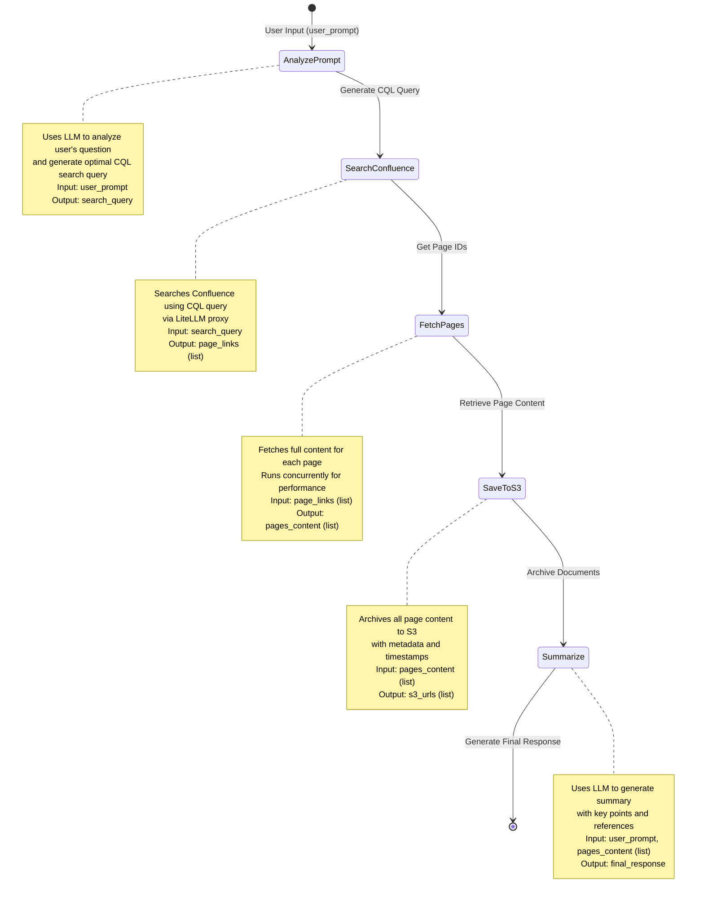
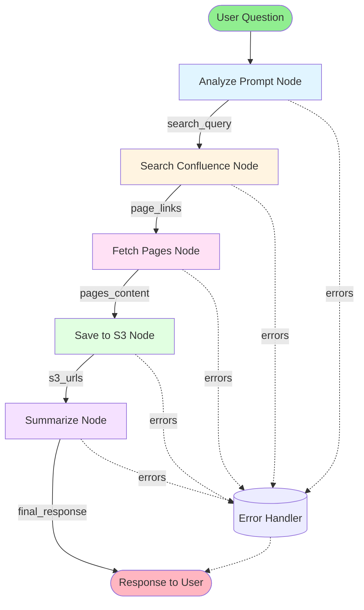
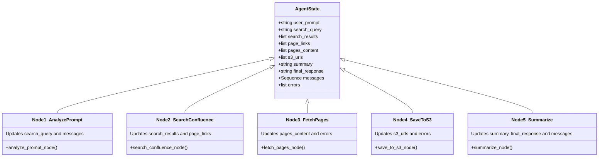
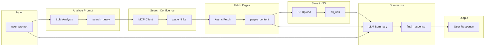
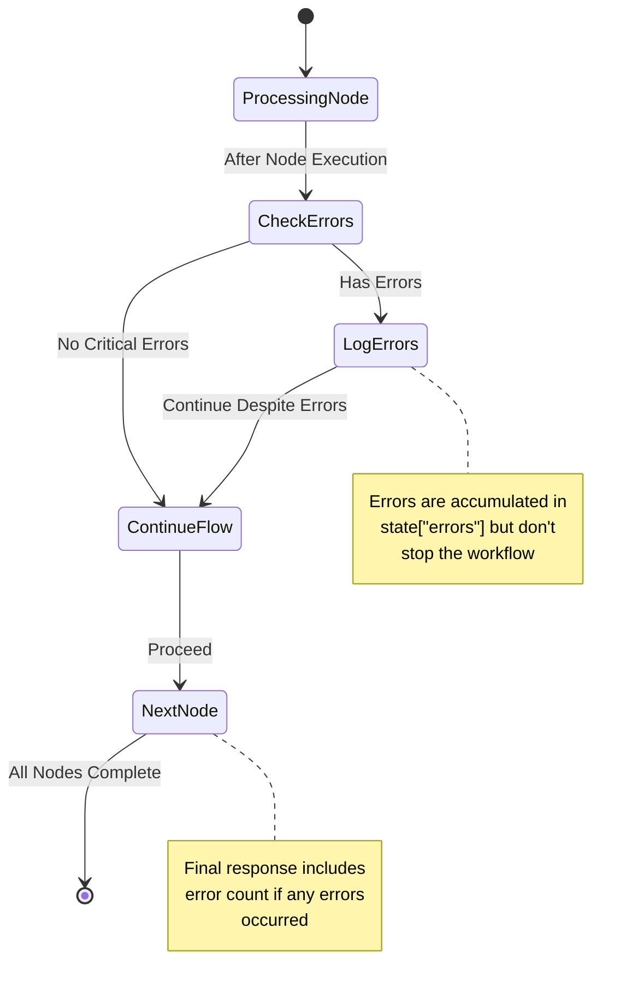

# Confluence Intelligent Agent Workflow

## State Diagram

```mermaid
stateDiagram-v2
    [*] --> AnalyzePrompt: User Input (user_prompt)
    
    AnalyzePrompt --> SearchConfluence: Generate CQL Query
    
    SearchConfluence --> FetchPages: Get Page IDs
    
    FetchPages --> SaveToS3: Retrieve Page Content
    
    SaveToS3 --> Summarize: Archive Documents
    
    Summarize --> [*]: Generate Final Response
    
    note right of AnalyzePrompt
        Uses LLM to analyze user's question
        and generate optimal CQL search query
        
        Input: user_prompt
        Output: search_query
    end note
    
    note right of SearchConfluence
        Searches Confluence using CQL query
        via LiteLLM proxy
        
        Input: search_query
        Output: page_links (list)
    end note
    
    note right of FetchPages
        Fetches full content for each page
        Runs concurrently for performance
        
        Input: page_links (list)
        Output: pages_content (list)
    end note
    
    note right of SaveToS3
        Archives all page content to S3
        with metadata and timestamps
        
        Input: pages_content (list)
        Output: s3_urls (list)
    end note
    
    note right of Summarize
        Uses LLM to generate summary
        with key points and references
        
        Input: user_prompt, pages_content (list)
        Output: final_response
    end note
```

## Detailed State Flow

```mermaid
graph TB
    Start([User Question]) --> A[Analyze Prompt Node]
    
    A -->|search_query| B[Search Confluence Node]
    
    B -->|page_links| C[Fetch Pages Node]
    
    C -->|pages_content| D[Save to S3 Node]
    
    D -->|s3_urls| E[Summarize Node]
    
    E -->|final_response| End([Response to User])
    
    A -.->|errors| ErrorHandler[(Error Handler)]
    B -.->|errors| ErrorHandler
    C -.->|errors| ErrorHandler
    D -.->|errors| ErrorHandler
    E -.->|errors| ErrorHandler
    
    ErrorHandler -.-> End
    
    style A fill:#e1f5ff
    style B fill:#fff4e1
    style C fill:#ffe1f5
    style D fill:#e1ffe1
    style E fill:#f5e1ff
    style Start fill:#90EE90
    style End fill:#FFB6C1
```

## Agent State Structure

```mermaid
classDiagram
    class AgentState {
        +string user_prompt
        +string search_query
        +list search_results
        +list page_links
        +list pages_content
        +list s3_urls
        +string summary
        +string final_response
        +Sequence messages
        +list errors
    }
    
    class Node1_AnalyzePrompt {
        +analyze_prompt_node()
        Updates search_query and messages
    }
    
    class Node2_SearchConfluence {
        +search_confluence_node()
        Updates search_results and page_links
    }
    
    class Node3_FetchPages {
        +fetch_pages_node()
        Updates pages_content and errors
    }
    
    class Node4_SaveToS3 {
        +save_to_s3_node()
        Updates s3_urls and errors
    }
    
    class Node5_Summarize {
        +summarize_node()
        Updates summary, final_response and messages
    }
    
    AgentState <|-- Node1_AnalyzePrompt
    AgentState <|-- Node2_SearchConfluence
    AgentState <|-- Node3_FetchPages
    AgentState <|-- Node4_SaveToS3
    AgentState <|-- Node5_Summarize
```

## Data Flow

```mermaid
flowchart LR
    subgraph Input
        UP[user_prompt]
    end
    
    subgraph Node1[Analyze Prompt]
        LLM1[LLM Analysis]
        SQ[search_query]
    end
    
    subgraph Node2[Search Confluence]
        MCP[MCP Client]
        PL[page_links]
    end
    
    subgraph Node3[Fetch Pages]
        Fetch[Async Fetch]
        PC[pages_content]
    end
    
    subgraph Node4[Save to S3]
        S3[S3 Upload]
        URLs[s3_urls]
    end
    
    subgraph Node5[Summarize]
        LLM2[LLM Summary]
        FR[final_response]
    end
    
    subgraph Output
        Response[User Response]
    end
    
    UP --> LLM1
    LLM1 --> SQ
    SQ --> MCP
    MCP --> PL
    PL --> Fetch
    Fetch --> PC
    PC --> S3
    S3 --> URLs
    PC --> LLM2
    UP --> LLM2
    URLs --> LLM2
    LLM2 --> FR
    FR --> Response
```

## Execution Timeline

```mermaid
gantt
    title Agent Workflow Execution Timeline
    dateFormat X
    axisFormat %s
    
    section Analysis
    Analyze Prompt (LLM)     :a1, 0, 2
    
    section Search
    Search Confluence (MCP)  :a2, 2, 1
    
    section Fetch
    Fetch Pages (Concurrent) :a3, 3, 3
    
    section Storage
    Save to S3 (Parallel)    :a4, 6, 2
    
    section Summary
    Summarize (LLM)          :a5, 8, 3
    
    section Response
    Return to User           :milestone, 11, 0
```

## Error Handling Flow

```mermaid
stateDiagram-v2
    [*] --> ProcessingNode
    
    ProcessingNode --> CheckErrors: After Node Execution
    
    CheckErrors --> ContinueFlow: No Critical Errors
    CheckErrors --> LogErrors: Has Errors
    
    LogErrors --> ContinueFlow: Continue Despite Errors
    
    ContinueFlow --> NextNode: Proceed
    
    NextNode --> [*]: All Nodes Complete
    
    note right of LogErrors
        Errors are accumulated in
        state["errors"] but don't
        stop the workflow
    end note
    
    note right of NextNode
        Final response includes
        error count if any errors
        occurred
    end note
```
